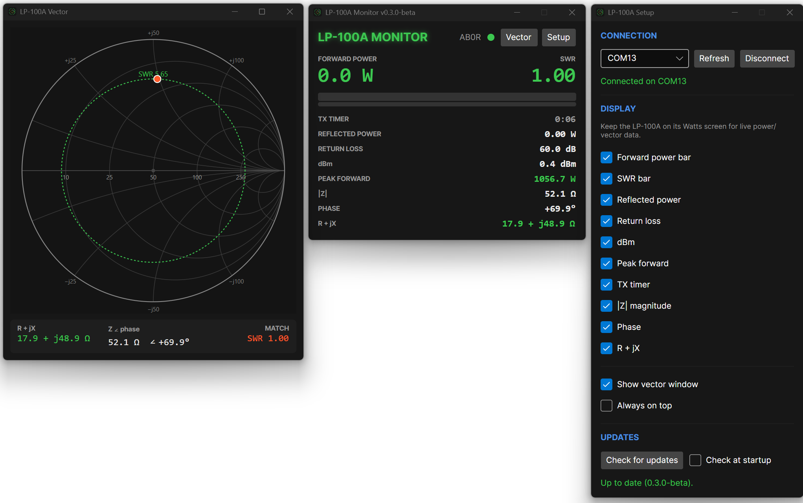
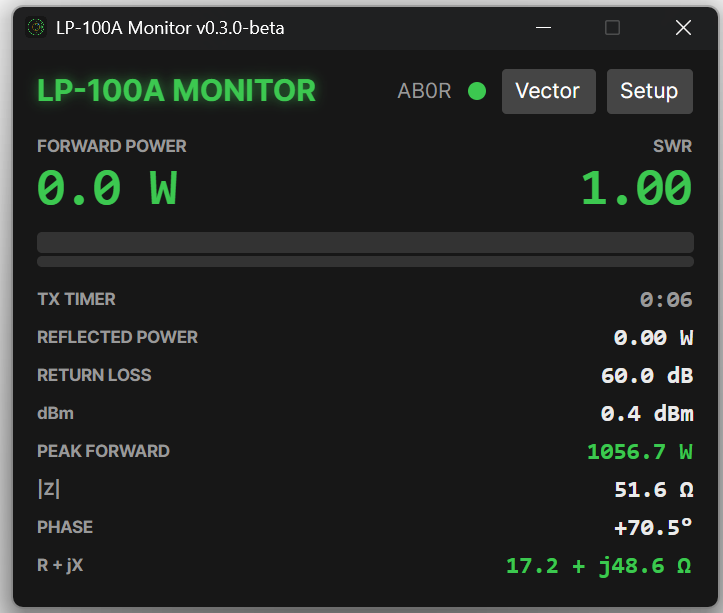
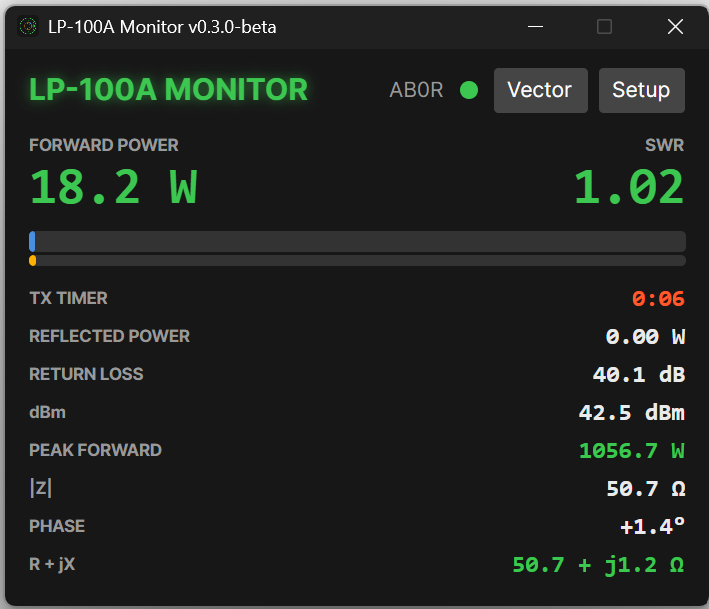

# LP-100A Monitor

A cross-platform desktop monitor for the TelePost **LP-100A Digital Vector RF
Wattmeter**, built on **.NET 8 + Avalonia**. It reads the meter over USB serial and
shows forward power, SWR, reflected power, return loss, dBm, and — the reason for
this app — the load impedance (**R + jX**) on a live **Smith chart**.

Runs on Windows, Linux, and Raspberry Pi (arm64).

> Status: **0.9.0-beta** — real and in use, but not yet broadly field-tested.

<p align="center">
  
</p>

## Download & run

Grab the build for your platform from the
[latest release](https://github.com/gsa700/lp100a-monitor/releases/latest) and unzip it.
The build is self-contained — no .NET install required.

- **Windows**: run `Lp100aMonitor.exe`.
- **Linux / Raspberry Pi**: `chmod +x Lp100aMonitor` then `./Lp100aMonitor`.

On first run, open **Setup**, pick the LP-100A's COM/serial port, and Connect. The
app pins that adapter by its chip serial and **auto-connects** next time. Keep the
meter on its **Watts screen** so power and vector data come across the serial link.

Once installed, you can update in place from **Setup → Updates → Check for updates** —
no need to download manually again.

## Windows

- **Main window** — power/SWR hero readouts, forward-power (with a peak-hold marker)
  and SWR bars, and toggleable rows (reflected power, return loss, dBm, peak, |Z|,
  phase, R + jX). Two of the rows are **clickable controls** for the meter:
  - **METER MODE** — shows the meter's Avg/Peak/Tune power mode; click to cycle it.
  - **METER ALARM** — shows the meter's SWR alarm setpoint (OFF/1.5/2.0/2.5/3.0/User);
    click to cycle it, setting the LP-100A's own hardware alarm and PTT-protect relay.
- **Vector window** — the Smith chart: constant-R/X grid with ohm labels, a live
  operating-point marker with a fading trail, and a constant-SWR circle. Great for
  antenna/tuner tuning.
- **Setup window** — port selection, display toggles, an on-screen SWR alarm banner
  toggle, peak-hold on/off, and in-app updates.

The **SWR bar** fills with a green → orange → red gradient whose colour breakpoints
scale to the meter's alarm setpoint — red anchors where your alarm trips. When the
alarm fires, the bar itself flashes red with the live **HIGH SWR** reading embedded in
it. This on-screen alert echoes the meter's own alarm setpoint (set on the METER ALARM
row, or in Setup → SWR ALARM) and can be switched off independently in Setup.
**Limitation:** the meter doesn't report the numeric value of its **User** setpoint over
serial, so the on-screen alert and the setpoint-scaled colours fall back to defaults for
the **User** or **Off** settings — the meter's hardware alarm/relay still works normally;
the presets 1.5–3.0 drive the on-screen alert.

Setup and Vector are children of the main window; closing the main window closes
everything. Window positions and display choices persist between runs.

|                      Idle                      |                 Transmitting (dummy load)                  |
| :--------------------------------------------: | :--------------------------------------------------------: |
|  |  |

## Serial protocol (per the official LP-100A manual, p.20)

- **115200 baud, 8N1, no flow control.** Send ASCII `P`; the meter replies with one
  frame delimited by a leading `;` (no CR/LF).
- Fields: `Power(W), Z(Ω), Phase(°), AlarmIdx, Callsign, PowerRange, MeterMode, dBm, SWR`
  - `AlarmIdx`: `0`=off, `1`=1.5, `2`=2.0, `3`=2.5, `4`=3.0, `5`=User.
  - `PowerRange`: autorange scale — `0`=High, `1`=Mid, `2`=Low (**not** a transmit flag;
    transmit is detected from forward power > 0).
  - `MeterMode`: `0`=Average, `1`=Peak, `2`=Tune.
- Control commands: `A` cycles the alarm setpoint, `F` cycles Avg/Peak/Tune. This app
  sends only those two — never `M` (mode/screen change), which would move the meter off
  its Watts screen and interrupt live data.
- The serial data reflects the meter's **active display screen** — keep it on the
  **Watts/Power screen** for live power/dBm/Z/phase.

## Build from source

Requires the .NET 8 SDK.

```
dotnet restore
dotnet run --project src/Lp100a.App
```

### Publish a self-contained build

```
dotnet publish src/Lp100a.App -c Release -r win-x64 \
  --self-contained -p:PublishSingleFile=true -o publish/win-x64
```

Swap `-r` for `linux-x64` or `linux-arm64` (Raspberry Pi) as needed.

## Layout

```
src/
  Lp100a.Core/   UI-agnostic library: SerialReader, StreamFramer, FrameParser, Lp100Reading
  Lp100a.App/    Avalonia app: MeterService, view-models, windows, SmithChartControl
```

The `Core` library has no UI dependency, so a future headless logger can reuse the
exact serial/parsing path.

## License

Released under the **GNU General Public License v3.0** — see [LICENSE](LICENSE).

## Credits

Created by David Erickson (AB0R) in collaboration with Claude (Anthropic).

Elecraft/TelePost are trademarks of their respective owners. This is an independent
project, not affiliated with or endorsed by TelePost.
